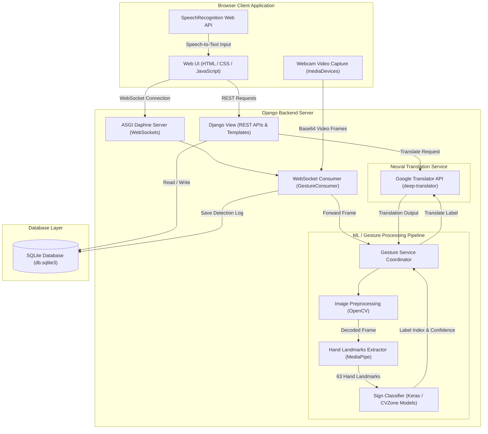
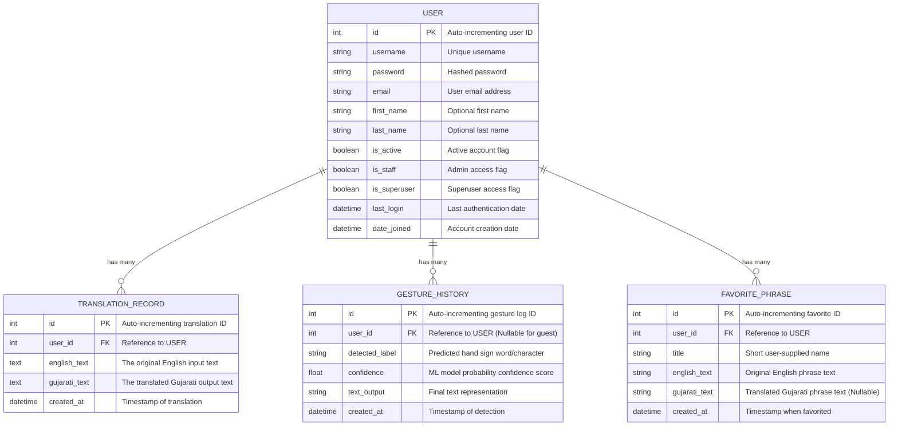

# SignTranslate: Accessibility Web App

SignTranslate is a state-of-the-art web application designed to break communication barriers for deaf, mute, and differently-abled users. Using standard Web APIs, MediaPipe hand-tracking models, and Django machine learning integrations, the system serves as an interactive communication assistant.

The project features a **Premium Accessible Soft UI** with harmonious pastel color palettes (lavenders, mints, soft blues) designed to limit eye strain and support high contrast accessibility guidelines.

---

## ✨ Features

- **English to Gujarati Neural Translation**: High-fidelity text translation utilizing neural models.
- **Enhanced Voice Conversion**:
  - **Speech-to-Text**: Converts spoken English/Gujarati input audio into readable text.
  - **Text-to-Speech**: Generates high-quality Gujarati speech audio (MP3 format) using Google Text-to-Speech (gTTS).
- **Real-Time Hand Sign Gesture Detection**:
  - Streams video frames from client webcam via WebSockets.
  - Preprocesses frames in OpenCV and extracts 63 distinct hand landmarks using **MediaPipe Hands**.
  - Runs classification models (Keras/CVZone) to predict character/word labels like *Hello, Yes, No, Help* at 90%+ confidence.
- **Activity Dashboard & Logs**: Aggregates translation counts, gesture recognition metrics, and recent activities.
- **History & Saved Favorites**: Offers quick-access libraries to save commonly used translations or phrases.

---

## 🏗️ System Architecture

The application is structured into decoupled frontend components, Django REST view endpoints, and async Channels/WebSockets interfaces:



---

## 🗄️ Database Schema (ERD)

The SQLite database structure maps core relationships for authenticated user accounts, translation record logs, real-time gesture histories, and quick-access favorites:



---

## 📂 Project Directory Structure

```
anti_minor/
├── backend/                              # Django Backend Project
│   ├── apps/
│   │   ├── users/                        # Auth & User Profile Management
│   │   ├── history/                      # Translation history logging
│   │   ├── gesture/                      # Live gesture sockets & history
│   │   └── favorites/                    # Saved quick-access phrases
│   ├── core/                             # Main settings, routing, and sockets consumers
│   ├── services/                         # Core Machine Learning & Translation services
│   │   ├── enhanced_translation_service.py # Expanded translation & language detection
│   │   ├── gesture_service.py            # Preprocessing & classification coordinator
│   │   ├── voice_converter.py            # Text-To-Speech & Speech-To-Text conversions
│   │   ├── preprocessing.py              # OpenCV frame landmarks decoder
│   │   └── hand_detection_datasets.py    # Public dataset configurations
│   ├── db.sqlite3                        # Sqlite database file
│   ├── manage.py                         # Django execution utility
│   ├── requirements.txt                  # Python package list
│   └── take_screenshots.py               # Automated screenshot pipeline script
│
├── frontend/                             # User Interface assets
│   ├── static/                           # CSS, Javascript and icons asset files
│   └── templates/                        # Premium accessible HTML templates
│
├── screenshots/                          # Automated high-resolution screenshots
└── README.md                             # Project Report
```

---

## 📸 Captured Previews

Full-length screenshots of the app layouts are located inside the `/screenshots/` folder:
- **Home**: `screenshots/1_home.png` — Main greeting and feature index.
- **Login**: `screenshots/2_login.png` / **Register**: `screenshots/3_register.png` — High-contrast user registration and authentication.
- **Camera Test**: `screenshots/4_camera_test.png` — Interactive webcam input checklist.
- **Dashboard**: `screenshots/5_dashboard.png` — Premium stats panels, activity charts, and links.
- **Translation Workspace**: `screenshots/6_translation.png` — Speech and text translator.
- **Live Gestures page**: `screenshots/7_gesture.png` — Real-time camera hand tracking panel.
- **History Logs**: `screenshots/8_history.png` — Timeline of translated conversations.
- **Favorites**: `screenshots/9_favorites.png` — Rapid-access saved library.

---

## ⚙️ Installation & Setup

1. **Clone & Open Project Directory**:
   ```bash
   cd anti_minor
   ```

2. **Install Core System Dependencies**:
   ```bash
   pip install django djangorestframework django-cors-headers python-dotenv deep-translator mediapipe opencv-python channels daphne tensorflow cvzone gtts SpeechRecognition pydub textblob langdetect
   ```

3. **Database migrations**:
   ```bash
   cd backend
   python manage.py makemigrations
   python manage.py migrate
   ```

4. **Run Daphne / Django Server**:
   ```bash
   python manage.py runserver
   ```
   *The server runs locally at `http://127.0.0.1:8000/`.*

---

## 🔌 API Endpoints Reference

### Translation & Voice
- **POST `/api/translator/enhanced/translate/`**
  - Translates text between 10+ languages (English, Gujarati, Hindi, etc.)
- **POST `/api/translator/voice/text-to-speech/`**
  - Generates downloadable MP3 speech files for translated text.
- **POST `/api/translator/voice/speech-to-text/`**
  - transcribes upload wav audio files to text.
- **GET `/api/translator/languages/`**
  - Lists all supported translation languages and codes.

### History & Sockets
- **GET/POST `/api/history/list/`** — Retreives or logs a translated text conversation.
- **GET/POST `/api/history/favorites/`** — Manages favorite phrases list.
- **WebSocket `/ws/gesture/`** — Real-time Base64 webcam frame classification pipeline.
